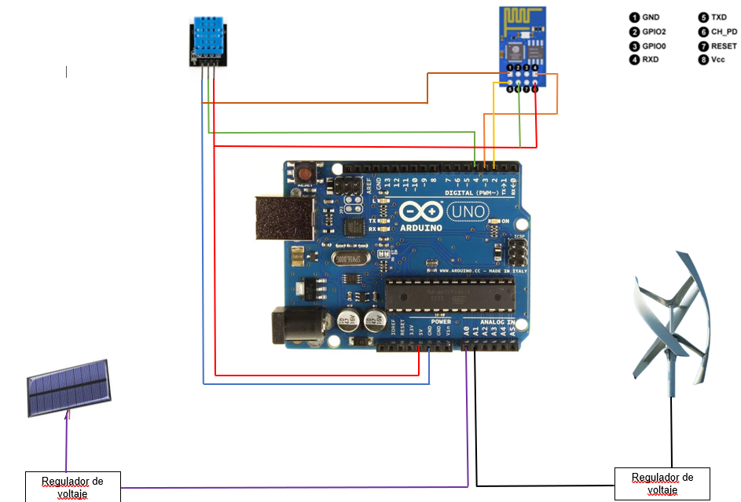
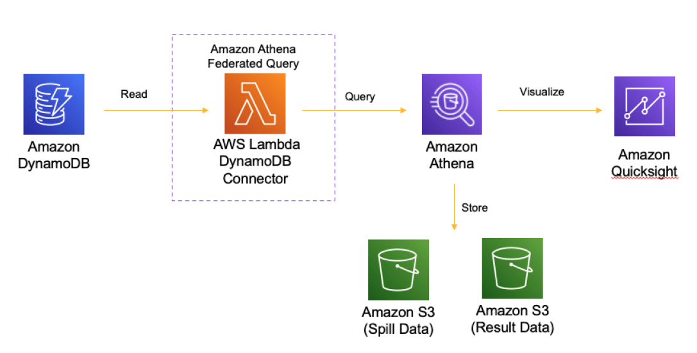

Modelo a Escala de una Estación Meteorológica que Emplea Energías Renovables

Es un dispositivo capaz de monitorear el flujo de aire, luz solar, la temperatura y humedad del ambiente. Conéctalo por WiFi y podrás ver gráficos para analizar los datos medidos y recibir alertas en tu correo electrónico.
La estación a escala cuenta con 4 sensores diferentes, y 2 de estos adicionalmente producirán energía de forma renovable. Cada sensor se centralizará con un microcontrolador (Arduino Uno) que prefiltrará y enviará la información a través de Wi-Fi para ser visualizada en una computadora. Los sensores serán presentados en un prototipo a escala.

Para más detalle revisar el manual de usuario del proyecto (escanear QR para descargar el manual):

### Índice

- [Características](#características)
- [Requisitos](#requisitos)
- [Configuración del Hardware](#configuración-del-hardware)
- [Configuración de AWS](#configuración-de-aws)
- [Instalación y Uso](#instalación-y-uso)
- [Estructura del Proyecto](#estructura-del-proyecto)
- [Documentación](#documentación)
- [Contribuciones](#contribuciones)
- [Licencia](#licencia)

### Características

- Monitoreo de temperatura y humedad del ambiente.
- Generación de voltaje a partir de paneles solares y una turbina eólica.
- Comunicación WiFi por MQTT hacia AWS
- Almacenamiento de datos en DynamoDB de AWS
- Análisis y diseño de dashboard con QuickSight 
...

### Requisitos

- Arduino UNO
- Sensor de humedad y temperatura DHT11
- Paneles solares y turbina eólica
- Módulo WiFi ESP01
- Arduino IDE
- Módulo conversor de ESP 01 a USB
- AWS Account para DynamoDB y QuickSight
...

### Configuración del Hardware

La conexión del hardware en este proyecto, es el siguiente:

Se toma en cuenta que los pines de Arduino UNO pueden ser cambiados con el código según la preferencia o disposición de los componentes.

Se deberá importar al proyecto las siguientes librerías:
- ArduinoJson 
- PubSubClient 
- Adafruit AWRprog
- DHT sensor library

Para ver el código implementado en Arduino UNO revisar:

- [Arduino](./Código de arduino/Arduino/Arduino.ino)

Para ver el código implementado Módulo WiFi ESP 01 revisar:

- [ESP8266](./Código de arduino/ESP8266/ESP8266.ino)

Para ver la asignación de red de internet y certificados revisar el archivo secrets.h:

- [Secrets](./Código de arduino/ESP8266/secrets.h)

Revisar el manual técnico del proyecto para más detalles (escanear QR para descargar el manual):

...

### Configuración de AWS

A continuación se presenta el diseño de la arquitectura del proyecto:

Pasos:
Comunicación por MQTT:
- Ingresar a AWS y crear una cuenta, seleccionar la opción “servicios” y seleccionar AWS IoT, crear recursos y certificado s de AWS IoT iniciando con las políticas ingresando en el apartado de seguridad y eligiendo políticas y creando una nueva.
-Elegir los permisos de la política para poder conectarse, recibir , publicar y susbribirse.
-En AWS IoT en el apartado de Manage, ingresar a la opción “Thing” u “Objetos”, luego seleccionar Create things y crear un nuevo objeto.
-Crear y descargar los certificados a utilzar.

Creación de base de datos y repcepción de data:
-En DynamoDB dentro de los servicios de AWS, en “Tables” se seleccionar “Create Table”. Elegir un nombre para la tabla, siendo “Clima” en este caso al usar un sensor de humedad y temperatura, con una clave de partición “ID” que se generará por la función lambda y para llave de ordenamiento un “Timestamp” como parte del mensaje MQTT desde el arduino.
- En la sección Table settings, seleccionar “Default Settings” y hacer clic en “CreateTable”.
- En el servicio Lambda, en la sección Functions seleccionar Create Function.

Creación de Función Lambda para que DynamoDB pueda recibir los datos por medio de MQTT:
- Se coloca un nombre descriptivo a la función, en el apartado Runtime se coloca Python
3.11 y se selecciona Create Function.
- Dentro de las opciones de configuración seleccionar Permissions y hacer clic en el hipervinculo del rol asociado a la función, lo que nos lleva a la política de permisos de la misma.
-Agregar el permiso necesario para escribir sobre la tabla creada. Para esto se obtuvo el identificador ARN de la tabla. En la sección Additional Information se copió el ARN de la tabla para agregarlo en el apartado de Resource de la sección de permisos adicionales.
- Hacer clic en la opción de Code de la función lambda. En un ejemplo de código se realiza una escritura en la tabla que se creó al inicio en DynamoDB desde la función lambda. Se ajustó el código para simular la creación de un registro en la tabla Clima y se presionó Deploy.
- Desplegar Function overview y seleccionar “Add trigger” y seleccionar "AWS IoT".
- En la configuración del desencadenador seleccionar “Custom IoT rule” y “Create a new rule”. En el apartado “Rule Name” colocar el nombre de “Desencadenador_MQTT” para identificar la regla. En “Rule query Statement” crear un statement SQL para que cada vez que se tenga un registro de entrada en IoT Core se produzca la ejecución de la función. La instancia SQL se ve de la siguiente manera: SELECT*FROM”esp8266/pub”. Por último, presionar ADD.

Conexión con AWS Analytics:
- Ingresar a la consola de Amazon Athena, es requerido crear y preparar S3 Data Bucket. Crear almacenamiento en S3 para recibir data de Athena.
- Crear una nueva fuente de datos de Athena y Elegir Amazon DynamoDB.
- Elegir "Configure new AWS Lambda function" para crear la conexión de Lambda, elegir "SpillBucket", "AthenaCatalogName" and confirm "Custom IAM Roles", and then click "Deploy". El Sistema automáticamente crea AWS CloudFormation para Lambda Connector.

Conexión con QuickSight para análisis y diseño del Dashboard:
- Ingresar a QuickSight e ir a "Manage QuickSight", en "Security & Permission" elegir "Add or Remove".
- Elegir Amazon Athena, Luego se verá la ventana de permisos de Amazon S3. Luego, seleccionar Athena Spill y Result Data Bucket con los permisos de escritura.
- Crear un dataset de Athena Data Source con el nombre de conexión, e.g."athena-dynamodb" y elegir el nombre del catálogo.
- Crear el análisis de data de su preferencia y exportarla a un panel.

Para más detalle revisar el manual técnico del proyecto (escanear QR para descargar el manual):

...

### Instalación y Uso
- Clonar este repositorio
- Sigue las instrucciones de Configuración del Hardware
- Configura tu cuenta de AWS según las instrucciones de Configuración de AWS
- Ejecuta el código en tu Arduino UNO según los archivos mencionados en Configuración del Hardware
- Accede a QuickSight para visualizar el dashboard
...

### Estructura del Proyecto

- Certificados: Posee los certificados de AWS utilizados en este proyecto.
- Código de Arduino: Posee el código implementado en Arduino UNO y Módulo ESP 01.
- Imagenes: Posee las imágenes y códigos QR utilizados.

...

### Documentación

- Código de Arduino: 

[Arduino](./Código de arduino/Arduino/Arduino.ino)

-Código del Módulo WiFi ESP 01:

[ESP8266](./Código de arduino/ESP8266/ESP8266.ino)

-Asignación de red de internet y certificados:

[Secrets](./Código de arduino/ESP8266/secrets.h)

-Manual Técnico:

[Manual Técnico](./Manual técnico.pdf)

-Manual de Usuario:

...
